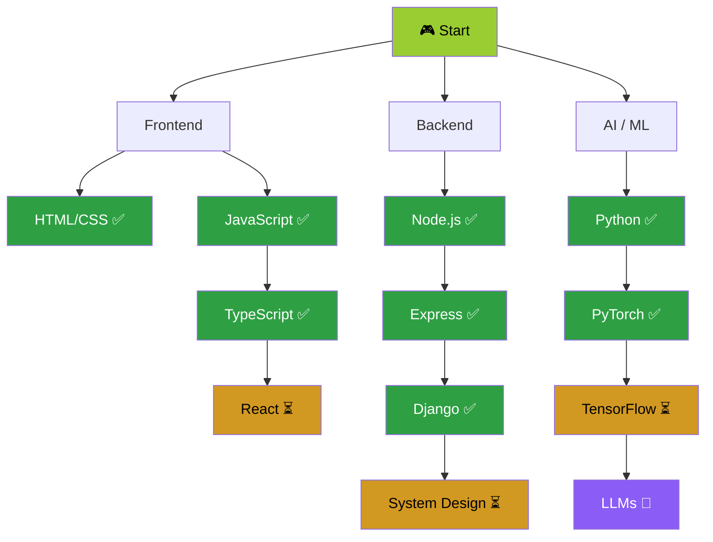

```
 ██████╗  █████╗ ███╗   ███╗
 ██╔══██╗██╔══██╗████╗ ████║
 ██████╔╝███████║██╔████╔██║
 ██╔══██╗██╔══██║██║╚██╔╝██║
 ██║  ██║██║  ██║██║ ╚═╝ ██║
 ╚═╝  ╚═╝╚═╝  ╚═╝╚═╝     ╚═╝
```

<div align="center">

*You have entered Ram's profile. Tread carefully — there are easter eggs.* 🥚

</div>

---

### 🎮 Character Sheet

| Stat | Level |
|---|---|
| **Class** | Full-Stack Developer |
| **Alignment** | Chaotic Caffeinated |
| **STR** (JavaScript / TypeScript) | █████████░ 90% |
| **DEX** (Node.js / Express) | ████████░░ 80% |
| **INT** (Python / Django / Flask) | ████████░░ 80% |
| **WIS** (AI/ML · PyTorch · TensorFlow) | ███████░░░ 70% |
| **CHA** (Documentation) | ██████░░░░ …working on it |
| **HP** | Refills with coffee ☕ |

---

### 🏆 Achievements Unlocked

> 🥇 **Midnight Debugger** — Fixed a prod bug at 3 AM. Felt nothing.  
> 🥈 **Framework Collector** — Tried a new framework before finishing the last one.  
> 🥉 **Stack Overflow Survivor** — Copy-pasted with *understanding*.  
> 🏅 **README Completionist** — You're reading the proof.

---

<details>
<summary>🗡️ <b>Dungeon Crawl: Choose Your Path</b> <i>(click to begin your quest)</i></summary>
<br>

> *You stand at the entrance of a dark dungeon. Torchlight flickers on the stone walls.*
> *Two passages stretch ahead…*

<details>
<summary>⬅️ <b>Go Left</b> — A narrow passage with strange carvings</summary>
<br>

> *The carvings depict ancient algorithms. You feel smarter already. +5 INT.*
>
> *Ahead, you see a locked chest and a glowing terminal.*

<details>
<summary>🔓 <b>Pick the Lock</b> — Use your DEX</summary>
<br>

> *Your nimble fingers work the mechanism…*
> *Click! The chest opens to reveal:*
>
> ```
> ╔══════════════════════════╗
> ║   🏆 LEGENDARY ITEM      ║
> ║   "The Golden Commit"     ║
> ║   +10 to all stats        ║
> ╚══════════════════════════╝
> ```
>
> *Achievement Unlocked: 🔓 Lock Picker — You opened it without `sudo`.*

</details>

<details>
<summary>💻 <b>Hack the Terminal</b> — Use your INT</summary>
<br>

> *You type furiously…*
>
> ```bash
> $ sudo unlock --force chest.lock
> [sudo] password for ram: ********
> Access granted. Decrypting...
> ```
>
> *The terminal reveals a secret scroll:*
> > *"The best code is no code. But the second best is well-documented code."*
>
> *+5 WIS. Achievement Unlocked: 💻 Terminal Wizard*

</details>

</details>

<details>
<summary>➡️ <b>Go Right</b> — A wide hall echoing with sounds of battle</summary>
<br>

> *You enter a grand hall. A wild* ***Bug*** *appears!*
> *It's a `NullPointerException`… in JavaScript. Terrifying.*

<details>
<summary>⚔️ <b>Fight the Bug</b> — Use your STR</summary>
<br>

> *You draw your keyboard and begin typing…*
>
> ```javascript
> try {
>   bug.eliminate();
> } catch (e) {
>   console.log("Nice try, bug.");
>   bug.squash();
> }
> ```
>
> *Critical Hit! The bug is vanquished!*
> *+10 XP, +5 STR. Achievement Unlocked: ⚔️ Bug Slayer*

</details>

<details>
<summary>🛡️ <b>Defend with Tests</b> — Use your WIS</summary>
<br>

> *You write a unit test to trap the bug…*
>
> ```javascript
> describe('Bug Defense', () => {
>   it('should not be null', () => {
>     expect(value).not.toBeNull();
>     // The bug screams and dissolves
>   });
> });
> ```
>
> *Tests passing: ✅ The bug is contained!*
> *+10 XP, +5 WIS. Achievement Unlocked: 🛡️ Test Guardian*

</details>

</details>

---

*No matter which path you chose, you survived the dungeon. +20 XP earned.* 🎉

</details>

<details>
<summary>🌳 <b>Skill Tree</b> <i>(click to view tech progression)</i></summary>
<br>



> ✅ Mastered &nbsp;│&nbsp; ⏳ In Progress &nbsp;│&nbsp; 🔮 Next Quest

</details>

<details>
<summary>🧩 <b>Riddle Gate</b> <i>(solve to pass)</i></summary>
<br>

> *A hooded guardian blocks your path and speaks:*
>
> **"I am not a loop, yet I repeat. I am not a function, yet I return.**
> **I have no body, yet I execute. What am I?"**

<details>
<summary>💡 <b>Reveal Answer</b></summary>
<br>

> **Recursion!** 🎉
>
> *The guardian nods and steps aside. +5 INT and the mass produced respect of every CS professor.*

</details>

---

> *Another guardian appears:*
>
> **"I have keys but no locks. I have space but no room. You can enter but can't go inside. What am I?"**

<details>
<summary>💡 <b>Reveal Answer</b></summary>
<br>

> **A Keyboard!** ⌨️
>
> *The guardian vanishes. +5 WIS. You are worthy.*

</details>

</details>

<details>
<summary>🗺️ <b>Side Quest: Explore My Projects</b> <i>(click to expand)</i></summary>
<br>

| Quest | Description | Status |
|---|---|---|
| [Project One](#) | Web technologies with a dash of geek | ⚔️ Active |
| [Project Two](#) | Backend services that keep on running | 🛡️ Active |

*More quests loading…*

</details>

<details>
<summary>📊 <b>Side Quest: View My Stats</b> <i>(click to expand)</i></summary>
<br>

<div align="center">


</div>

</details>

<details>
<summary>🕹️ <b>Bonus Boss Fight: Play Snake!</b> <i>(leaves profile — external link)</i></summary>
<br>

<div align="center">

**Think you've got reflexes? Prove it.**

### [🐍 Play Ram's Nokia Snake Game](https://ramachandrakulkarni.github.io/RamachandraKulkarni/snake.html)

> A fully working retro Nokia-style Snake game hosted on GitHub Pages.
> Eat the apples 🍎, grow longer, don't hit the walls or yourself!
> **Controls:** Arrow keys / WASD / swipe on mobile / on-screen buttons

*Beat my high score and earn +100 XP bragging rights.*

</div>

</details>

<details>
<summary>🥚 <b>Secret Room</b> <i>(are you sure?)</i></summary>
<br>

You found the easter egg! Here's your mass production, factory made, not-at-all special reward:

```
        ___
       /   \
      | 🌟  |
       \___/
    You gained +1 Curiosity.
```

**Fun fact:** I once mass produced `console.log("here")` across 47 files to find a bug.
The bug was a missing semicolon. In a Python file. There are no semicolons in Python.

</details>

---

### 📫 How to Reach Me

[](mailto:your_email@example.com)
[](#)
[](#)

---

<div align="center">

*Thanks for visiting. You've earned **+10 XP** just for scrolling this far.* ✨


</div>
